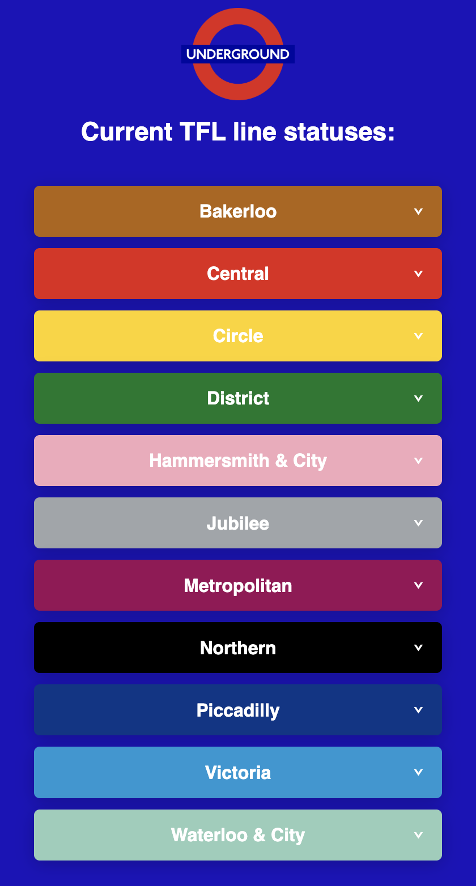

# React Tube Line Challenge

In this lab you will build an App to monitor the current status of the London Underground. This simple fetch/axios lab allows you to practice "background fetching" in React using `useEffect`.

Using the TfL API, build a mobile-oriented web app that:
• Lists the London Underground lines sorted alphabetically
• Shows the current status of each line
• Updates the status every 5 minutes setInterval

Use the following endpoint: `https://api.tfl.gov.uk/line/mode/tube/status`. Don't forget to test the endpoint in Postman first!

## Example

Feel free to style the app as you wish, but here's a simple example of what you might produce:



## Getting started

### Bootstrap the folder structure using Vite
In this folder, create your vite structure with the following command (the `.` adds all the files inside this folder, rather than creating a new one) - It will ask how to proceed, choose "Ignore files and continue":
```bash
npm create vite@latest .
```

### Reset App.jsx
Next, remove the content from App.jsx, replacing with an empty App component:
```jsx
import './App.css'

const App = () => {
  return (
    <h1>Hello World</h1>
  )
}

export default App
```

### Resetting CSS
You can also clear out the CSS from both `App.css` and `index.css` if you wish to style it out from scratch!

### Start your server
Start your server to start developing
```bash
npm run dev
```

### Get coding!
Once the above is complete, you can begin the exercise! Good luck!